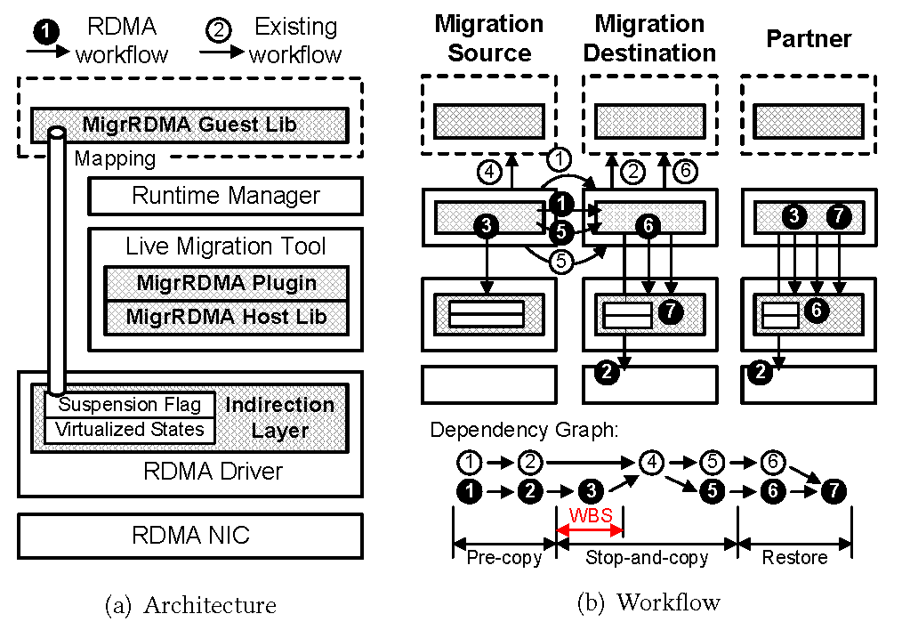

# MigrRDMA

## Overview

MigrRDMA is the first software-based RDMA live migration solution without modifying the RNIC.
This repository releases our implementation prototype.
The MigrRDMA's components are in [src/](./src).
The scripts and applications supporting the live migration workflow are in [utils/](./utils).
Our implementation is based on MLNX OFED Driver 5.4 (including the kernel-space driver and the userspace library, each stored in a seperate directory in [src/](./src)),
CRIU 3.18, and [runc](https://github.com/opencontainers/runc/tree/8fc5be4e60246eb9f7c50e9150f9b1d21f835f8a).
To figure out what exact change we made to each component,
you can click the commit message behind each of their directories inside [src/](./src).

MigrRDMA was accepted in SIGCOMM'25.
Interested readers may refer to [our paper](./docs/migrrdma_paper.pdf).

## Prerequisites

We have successfully built MigrRDMA under Ubuntu 20.04 and 22.04.
Before building MigrRDMA, please make sure your system has satisfied all the following prerequisites.

### Build Linux Kernel

The MigrRDMA driver has been compiled and installed successfully on Linux kernel 5.8 and 5.12.
Thus, we recommend re-constructing MigrRDMA on one of the Linux kernels from 5.8 to 5.12.

### Install Necessary Packages

```bash
$ apt-get -y install cmake asciidoc python3 python3-pip automake autoconf libpci-dev \
			pkg-config libnl-route-3-dev protobuf-c-compiler protobuf-compiler \
			libprotobuf-c-dev libnet1-dev libcap-dev libseccomp-dev
```

### Install Go1.20

```bash
$ wget https://go.dev/dl/go1.20.linux-amd64.tar.gz
$ tar -zxf go1.20.linux-amd64.tar.gz
$ cd go
$ echo "export GOPATH=$(pwd)" >> ~/.bashrc
$ echo "export PATH=\${GOPATH}/bin:\${PATH}" >> ~/.bashrc
$ source ~/.bashrc
```

### Install Docker-ce

MigrRDMA integrates well with different Docker releases.
So far, we have verified that against Docker 19.03 and 20.10. You may try other Docker releases.

Please execute the following commands to install `docker-ce` (you can refer to [this Docker installation tutorial](https://docs.docker.com/engine/install/ubuntu/)):

```Bash
$ sudo apt-get update
$ sudo apt-get -y install ca-certificates curl
$ sudo install -m 0755 -d /etc/apt/keyrings
$ sudo curl -fsSL https://download.docker.com/linux/ubuntu/gpg -o /etc/apt/keyrings/docker.asc
$ sudo chmod a+r /etc/apt/keyrings/docker.asc
$ echo "deb [arch=$(dpkg --print-architecture) signed-by=/etc/apt/keyrings/docker.asc] https://download.docker.com/linux/ubuntu $(. /etc/os-release && echo "${UBUNTU_CODENAME:-$VERSION_CODENAME}") stable" | sudo tee /etc/apt/sources.list.d/docker.list > /dev/null
$ sudo apt-get update
$ sudo apt-get -y install docker-ce=5:20.10.13~3-0~ubuntu-jammy
```

You can execute `apt-cache madison docker-ce` to check all the available versions of `docker-ce` on your local server,
and replace the `5:20.10.13~3-0~ubuntu-jammy` part with what you prefer.

## Build and Install MigrRDMA

Follow the steps to build MigrRDMA.

### Build Container Image

```Bash
$ ./container_init.sh
```

### Build Driver, Lib, CRIU, runc, and utils

```Bash
$ make
$ sudo make install
```

Note: Feel free to ignore the error message during the installation of `mlnx-tools`.

The installation of MigrRDMA driver is not permanently effective.
After reboot, the server loads the regular RDMA driver by default.
Thus, you need to execute the following commands to install the MigrRDMA driver again:

```Bash
$ sudo rm .mlnx_drv_install
$ sudo make mlnx_install
```

### Verify

To verify whether the regular `perftest` runs correctly, you can start `perftest` with the following settings:

On the receiver:

```Bash
$ ib_send_bw -d [DEV] --use_old_post_send -a
```

On the sender:

```Bash
$ ib_send_bw -d [DEV] --use_old_post_send -a [IP address of the receiver]
```

where [DEV] is the name of one of the devices listed in the first column of `show_gids`.

Please note that our implementation only covers the standard verbs APIs. Thus, `--use_old_post_send` option is necessary here.

## Live Migration Demo

After all the verification is done, you can run a simple demo for RDMA live migration.



The above figure is our overview.
The service to be migrated is originally running on the migration source. It has established connections with the partner.
When the operator decides the migration destination, it pre-dumps the states of memory and RDMA (Step 1), and starts partial restore (Step 2), both done by [CRIU](./src/criu-3.18).
When doing Step 1, CRIU on the migration source notifies the partner to establish new connections.
We implement a [MigrRDMA Daemon](./src/migrrdma_daemon) (which runs on the partner) to receive the notification, and it later notifies the MigrRDMA Guest Lib to create new QPs.

When stop-and-copy starts, the migration source does wait-before-stop first (Step 3, implemented in [wbs_external](./src/wbs_external)).
This step needs to notify the partner to also conduct WBS.
When the partners finishes WBS, the MigrRDMA Daemon notifies the `wbs_external`.
Then, CRIU dumps all the rest states (Step 4).
These states will be copied to the migration destination (Step 5).
On the migration destination, CRIU starts full restore (Step 6).
After all the resotration finishes, CRIU restores the RDMA communication (Step 7).
Step 7 needs to notify the partner to switch to new communications.
In this demo, we use `scp` to transfer the states if the migration source and destination reside in different servers.

Regularly, the sender and receiver execute the commands shown in the [verification](#Verify) part.
If migrating one of them, start the MigrRDMA Daemon on the partner first:

```Bash
$ cd src/migrrdma_daemon
$ sudo ./migrrdma_daemon [DEV]
```

where [DEV] is the name of one of the devices listed in the first column of `show_gids`.

Besides, add `./rdma_migr_demo.sh with_pre_setup (or wo_pre_setup) [IP address of migr_dst]` before the commands executed by the migration source, e.g.,

```Bash
$ cd [ROOT directory of this repository]
$ ./rdma_migr_demo.sh with_pre_setup [IP address of migr_dst] ib_send_bw ...
```

The `rdma_migr_demo.sh` first starts a container that runs the commands started from the 3rd argument (./rdma_migr_demo.sh is the 0th argument), and starts live migration after 30 seconds.
All the scripts supporting live migration with and without RDMA pre-setup are in [utils/](./utils).
